<authentication_analysis>

1.  **Lista komponentów i stron:**
    *   **Istniejące komponenty UI (`src/components/ui/`):** `button.tsx`, `Input.tsx`, `sonner.tsx`. Będą one reużywane w formularzach autentykacji. `sonner.tsx` posłuży do wyświetlania powiadomień o błędach i sukcesach.
    *   **Nowe komponenty Auth (`src/components/auth/`):**
        *   `LoginForm.tsx`: Formularz logowania.
        *   `RegisterForm.tsx`: Formularz rejestracji.
        *   `ResetPasswordForm.tsx`: Formularz do wysyłania linku resetującego hasło.
        *   `UpdatePasswordForm.tsx`: Formularz do ustawiania nowego hasła.
        *   `SignOutButton.tsx`: Przycisk do wylogowywania.
    *   **Strony publiczne (`src/app/(public)/`):**
        *   `login/page.tsx`: Strona z formularzem logowania.
        *   `register/page.tsx`: Strona z formularzem rejestracji.
        *   `reset-password/page.tsx`: Strona z formularzem do resetowania hasła.
        *   `update-password/page.tsx`: Strona z formularzem do aktualizacji hasła.
    *   **Strony prywatne (`src/app/(authed)/`):**
        *   `page.tsx`: Główny dashboard aplikacji.
        *   `offers/[id]/page.tsx`: Strona szczegółów oferty.
    *   **Layouty:**
        *   `src/app/layout.tsx`: Główny layout, będzie zawierał komponent `Toaster` z `sonner` do globalnych powiadomień.
        *   `src/app/(authed)/layout.tsx`: Layout dla zalogowanych użytkowników, będzie zawierał `SignOutButton`.
    *   **Logika backendowa:**
        *   `src/app/auth/actions.ts`: Plik z akcjami serwerowymi (Server Actions) takimi jak `signIn`, `signUp`, `signOut` itd.

2.  **Przepływ danych:**
    *   Użytkownik wchodzi na jedną ze stron publicznych (np. `/login`).
    *   Strona (`login/page.tsx`) renderuje odpowiedni komponent formularza (`LoginForm.tsx`).
    *   Komponent formularza (`LoginForm.tsx`) używa współdzielonych komponentów UI (`Input.tsx`, `button.tsx`).
    *   Po wypełnieniu i wysłaniu formularza, komponent (`LoginForm.tsx`) wywołuje odpowiednią akcję serwerową z `auth/actions.ts`.
    *   Akcja serwerowa komunikuje się z Supabase, a następnie zwraca wynik (sukces lub błąd).
    *   Komponent formularza przechwytuje wynik i za pomocą `sonner` wyświetla użytkownikowi stosowny komunikat.
    *   W przypadku sukcesu logowania, `middleware` przekierowuje użytkownika do strony prywatnej (np. `/`).
    *   Strony prywatne są opakowane w `(authed)/layout.tsx`, który zawiera przycisk `SignOutButton.tsx`.

```mermaid
flowchart TD
    subgraph "Struktura Aplikacji (app)"
        subgraph "Layouts"
            RootLayout["app/layout.tsx"]
            AuthedLayout["(authed)/layout.tsx"]
        end

        subgraph "Strony Publiczne (public)"
            LoginPage["login/page.tsx"]
            RegisterPage["register/page.tsx"]
            ResetPage["reset-password/page.tsx"]
            UpdatePage["update-password/page.tsx"]
        end

        subgraph "Strony Prywatne (authed)"
            DashboardPage["page.tsx (Dashboard)"]
            OfferDetailsPage["offers/[id]/page.tsx"]
        end
    end

    subgraph "Komponenty (components)"
        subgraph "Moduł Autentykacji (auth)"
            LoginForm["LoginForm.tsx"]
            RegisterForm["RegisterForm.tsx"]
            ResetForm["ResetPasswordForm.tsx"]
            UpdateForm["UpdatePasswordForm.tsx"]
            SignOutButton["SignOutButton.tsx"]
        end

        subgraph "Współdzielone UI (ui)"
            Button["ui/button.tsx"]
            Input["ui/Input.tsx"]
            Sonner["ui/sonner.tsx (Toaster)"]
        end
    end

    subgraph "Logika Backendowa"
        ServerActions["auth/actions.ts"]
    end

    %% Relacje
    RootLayout -- zawiera --> Sonner
    RootLayout -- opakowuje --> LoginPage
    RootLayout -- opakowuje --> RegisterPage
    RootLayout -- opakowuje --> ResetPage
    RootLayout -- opakowuje --> UpdatePage
    RootLayout -- opakowuje --> AuthedLayout

    AuthedLayout -- zawiera --> SignOutButton
    AuthedLayout -- opakowuje --> DashboardPage
    AuthedLayout -- opakowuje --> OfferDetailsPage

    LoginPage -- renderuje --> LoginForm
    RegisterPage -- renderuje --> RegisterForm
    ResetPage -- renderuje --> ResetForm
    UpdatePage -- renderuje --> UpdateForm

    LoginForm -- używa --> Button
    LoginForm -- używa --> Input
    RegisterForm -- używa --> Button
    RegisterForm -- używa --> Input
    ResetForm -- używa --> Button
    ResetForm -- używa --> Input
    UpdateForm -- używa --> Button
    UpdateForm -- używa --> Input

    LoginForm -- "wywołuje signIn()" --> ServerActions
    RegisterForm -- "wywołuje signUp()" --> ServerActions
    ResetForm -- "wywołuje sendPasswordResetLink()" --> ServerActions
    UpdateForm -- "wywołuje updatePassword()" --> ServerActions
    SignOutButton -- "wywołuje signOut()" --> ServerActions

    classDef page fill:#cde,stroke:#333,stroke-width:2px;
    classDef component fill:#f9f,stroke:#333,stroke-width:2px;
    classDef layout fill:#e8d5b5,stroke:#333,stroke-width:2px;
    classDef logic fill:#ccf,stroke:#333,stroke-width:2px;

    class LoginPage,RegisterPage,ResetPage,UpdatePage,DashboardPage,OfferDetailsPage page;
    class LoginForm,RegisterForm,ResetForm,UpdateForm,SignOutButton,Button,Input,Sonner component;
    class RootLayout,AuthedLayout layout;
    class ServerActions logic;
```

</authentication_analysis>
<mermaid_diagram>

</mermaid_diagram>
