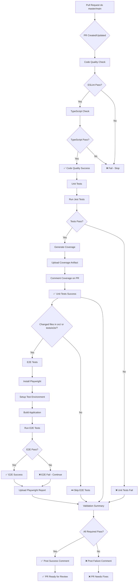
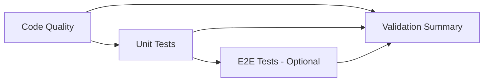
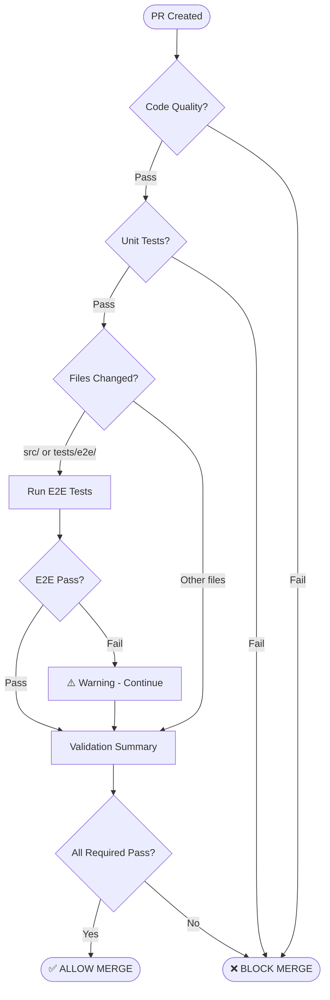
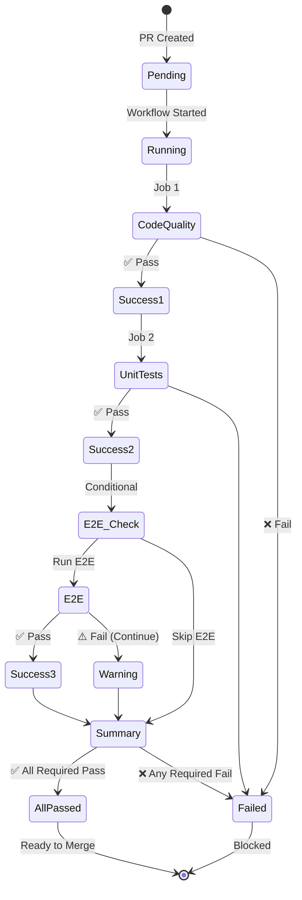
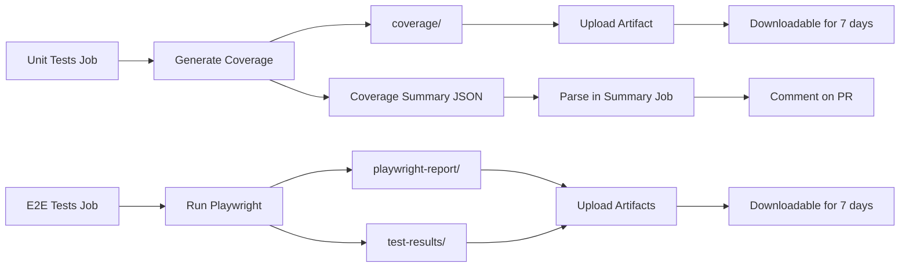
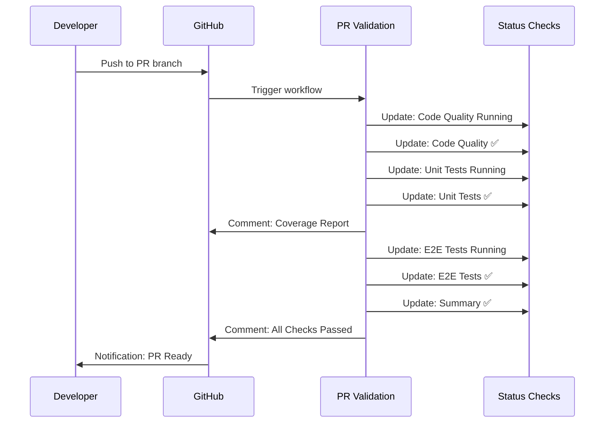

# PR Validation Workflow - Diagram

## Workflow Flow

## Job Dependencies

## Timeline Example (Successful PR)

```mermaid
gantt
    title PR Validation Timeline
    dateFormat  ss
    section Code Quality
    Checkout & Setup           :a1, 00, 30s
    NPM Install                :a2, after a1, 60s
    ESLint                     :a3, after a2, 20s
    TypeScript Check           :a4, after a3, 15s
    
    section Unit Tests
    Checkout & Setup           :b1, after a4, 30s
    NPM Install                :b2, after b1, 60s
    Run Tests                  :b3, after b2, 90s
    Generate Coverage          :b4, after b3, 10s
    Upload Artifacts           :b5, after b4, 15s
    
    section E2E Tests
    Checkout & Setup           :c1, after b5, 30s
    NPM Install                :c2, after c1, 60s
    Install Playwright         :c3, after c2, 45s
    Build App                  :c4, after c3, 120s
    Run E2E Tests              :c5, after c4, 180s
    Upload Reports             :c6, after c5, 20s
    
    section Summary
    Check Results              :d1, after c6, 10s
    Post Comments              :d2, after d1, 15s
```

## Decision Tree

## Status Badge States

## Artifact Flow

## Notification Flow

---

## Legend

### Status Indicators
- ✅ Success (green)
- ❌ Failure (red)
- ⏭️ Skipped (gray)
- ⚠️ Warning (yellow)
- 🔄 Running (blue)

### Job Types
- **Required Jobs**: Must pass for merge
  - Code Quality
  - Unit Tests
  - Validation Summary

- **Optional Jobs**: Can fail without blocking
  - E2E Tests (conditional)

### Timing Estimates
- Code Quality: ~2 min
- Unit Tests: ~3 min
- E2E Tests: ~6 min
- Summary: ~30 sec

**Total (with E2E): ~11 min**  
**Total (without E2E): ~5 min**

---

*Diagrams generated with Mermaid syntax*
